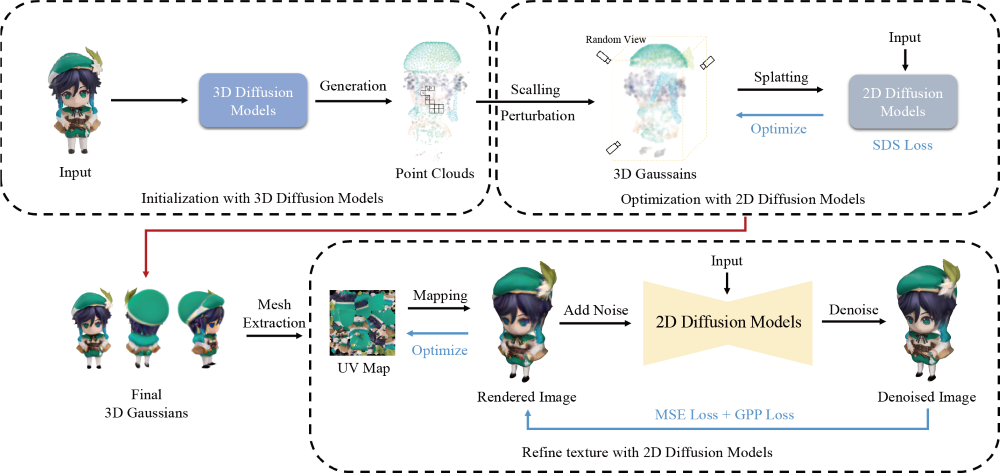
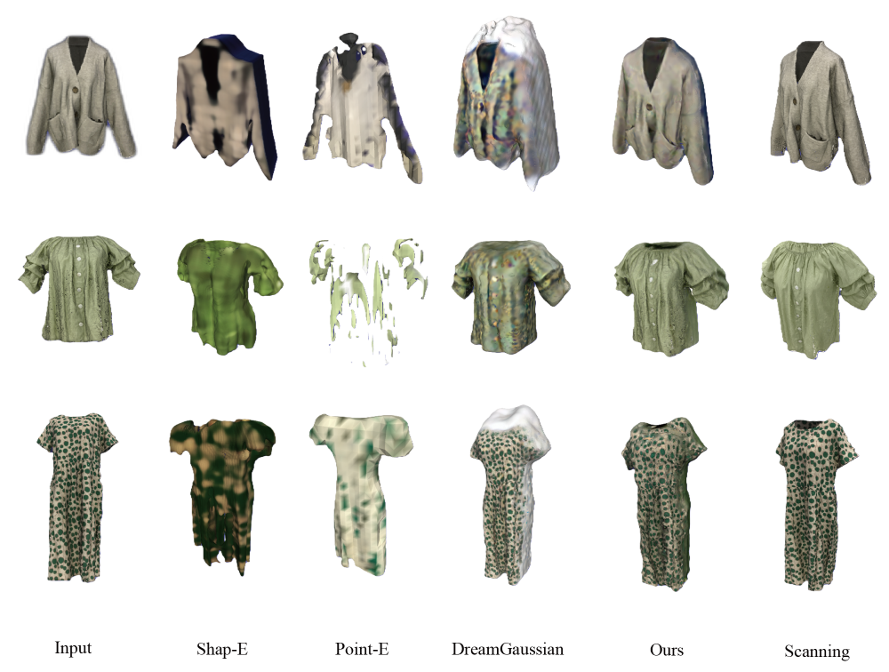

# ScalingGaussian
ScalingGaussian: Enhancing 3D Content Creation with Generative Gaussian Splatting


<a href='https://arxiv.org/abs/2407.19035'>




## Updates
Although we cannot confirm a specific release date at this time, rest assured that we will provide the demo and source code after the paper is accepted. 

We will take the necessary steps to clean, document, and test the code to ensure ease of use. 

Thank you for your understanding and continued support.

## Citation	

```
@article{chen2024scalinggaussian,
  title={ScalingGaussian: Enhancing 3D Content Creation with Generative Gaussian Splatting},
  author={Chen, Shen and Zhou, Jiale and Jiang, Zhongyu and Zhang, Tianfang and Wu, Zongkai and Hwang, Jenq-Neng and Li, Lei},
  journal={arXiv preprint arXiv:2407.19035},
  year={2024}
}

```
